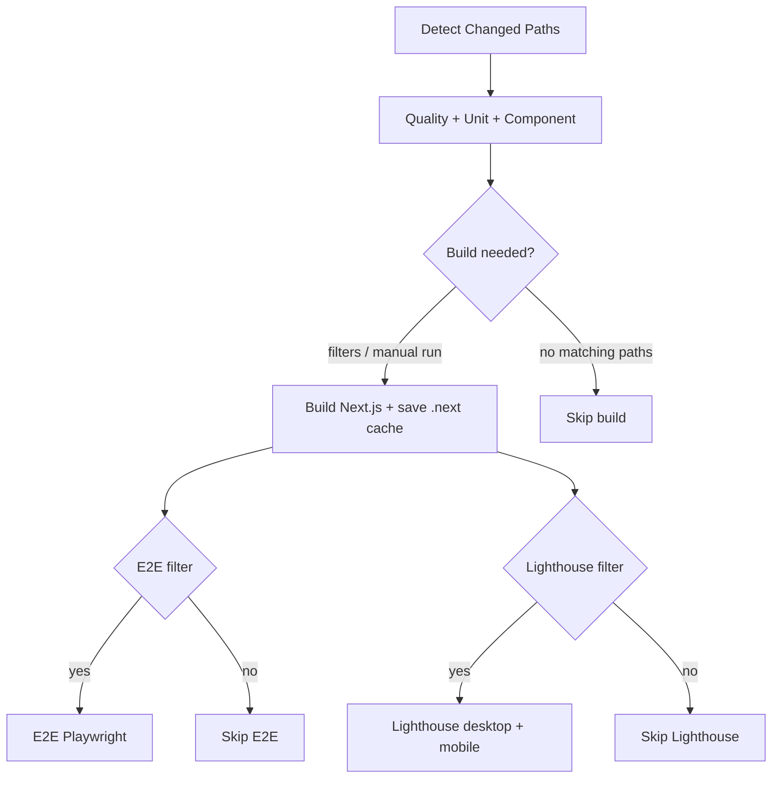

# Link-in-Bio Portfolio

This repository contains a fast, accessible single-page portfolio built with **Next.js 15**, **TypeScript**, **Tailwind CSS**, and **JSON-driven** content validated at runtime with **Zod**. Site copy and structure are edited through `data/*.json`; releases flow through **GitHub Actions** and **Vercel**.

---

## Stack

| Layer | Choice |
|--------|--------|
| Framework | Next.js 15 (App Router) |
| Language | TypeScript (strict) |
| Styling | Tailwind CSS |
| Content | Local JSON + Zod (`lib/schema.ts`, `lib/data.ts`) |
| Unit / component tests | Vitest + Testing Library |
| E2E | Playwright |
| Quality gates | ESLint, `tsc`, Lighthouse CI (desktop + mobile) |
| CI | GitHub Actions (`ubuntu-latest`, Node 24) |
| Hosting | Vercel (`main`) |

---

## Features

The app exposes a JSON-driven profile, social links, projects, and tech stack. Schemas are validated before render; featured projects are sorted ahead of non-featured items. Sections (hero, projects, socials, tech marquee) are composed from reusable components with accessibility considered. The tech stack uses a two-track marquee with hover pause and reduced-motion support.

---

## Project structure

| Path | Role |
|------|------|
| `app/` | Routes, layout, metadata (`page.tsx`, `layout.tsx`) |
| `components/` | UI sections and cards |
| `data/*.json` | Editable site content |
| `lib/` | Zod schemas, loaders, types |
| `public/` | Static assets |
| `e2e/` | Playwright specs |
| `scripts/run-lighthouse.mjs` | Lighthouse CI entry point; in CI it skips `next build` when `CI` is set and `.next/BUILD_ID` exists (restored cache from the Build job) |

---

## Local development

Dependencies are installed with `npm ci` or `npm install`. An optional `.env.local` may define `NEXT_PUBLIC_SITE_URL` for local metadata. The dev server is started with `npm run dev`. Typecheck, lint, and production build are available via `npm run typecheck`, `npm run lint`, and `npm run build`.

---

## Environment variables

`lib/env.ts` and layout metadata read the public site URL from the environment.

| Variable | Purpose |
|----------|---------|
| `NEXT_PUBLIC_SITE_URL` | Optional; sets `metadataBase` in `app/layout.tsx` |

For GitHub Actions, the same value may be stored as the repository secret `NEXT_PUBLIC_SITE_URL` so CI builds align with production URL assumptions where applicable.

---

## Test commands

| Command | Scope |
|---------|--------|
| `npm run test:unit` | Vitest: `lib/**/*.test.ts` |
| `npm run test:component` | Vitest: `components/**/*.test.tsx` |
| `npm run test:e2e` | Playwright against the local app (`playwright.config.ts`) |
| `npm run test:lighthouse` | Production build when needed, then Lighthouse CI (desktop + mobile) via `scripts/run-lighthouse.mjs` |
| `npm run test:local` | Typecheck, lint, build, unit, component, e2e, and Lighthouse in sequence |

---

## CI/CD

The workflow is defined in **[`.github/workflows/ci.yml`](.github/workflows/ci.yml)**.

### Triggers

| Event | Behavior |
|-------|----------|
| **Pull request** to `main` | Full detection + jobs per path rules |
| **Push** to `main` | Same pipeline on the merge commit so status checks exist on the default branch (used by **Vercel deployment checks** to resolve GitHub job names) |
| **`workflow_dispatch`** | Manual run from the Actions tab; runs the **full** pipeline (expensive jobs are not skipped by path filters) |

Concurrency is limited to one active run per ref (`ci-${{ github.ref }}`); newer runs supersede older ones on the same branch.

### Pipeline overview

1. **Detect Changed Paths** — Diff paths are classified into four buckets (see below).
2. **Quality + Unit + Component** — Always runs after detection: install, `typecheck`, `lint`, `test:unit`, `test:component`. In CI, Vitest uses verbose and GitHub Actions reporters.
3. **Build (Next.js)** — Runs when any filter matches or when the workflow is dispatched manually. It depends on **Quality + Unit + Component**, so lint/type/unit failures prevent `next build`. The `.next` output is saved to `actions/cache` under `build-${{ github.sha }}`.
4. **E2E** and **Lighthouse** — Start only after a successful build (each gated by its own filter). They restore `.next` from cache; the Lighthouse script avoids a second full build when CI sees a restored `.next/BUILD_ID`.

### Path filters

Filters control **Build**, **E2E**, and **Lighthouse**; they do not skip the quality job.

| Filter | Paths (summary) | Drives |
|--------|-----------------|--------|
| **frontend** | `app/**`, `components/**`, `data/**`, `lib/**`, `public/**`, `next.config.*`, `tailwind.config.*`, `postcss.config.*`, optional root `middleware.ts` / `instrumentation.ts` | Build; E2E; Lighthouse |
| **deps** | `package.json`, `package-lock.json` | Build; E2E; Lighthouse |
| **tests** | `e2e/**`, `**/*.test.*`, `**/*.spec.*`, `vitest.config.*`, `vitest.setup.ts`, `playwright.config.*` | Build; E2E |
| **lighthouse_ci** | `lighthouserc*.json`, `scripts/run-lighthouse.mjs` | Build; Lighthouse |

| Job | Condition |
|-----|-----------|
| **Build** | Any filter true, or manual dispatch |
| **E2E** | `frontend` or `tests` or `deps`, or manual dispatch |
| **Lighthouse** | `frontend` or `deps` or `lighthouse_ci`, or manual dispatch |

Changes that only touch documentation (e.g. this README) usually match no build filters, so **Build / E2E / Lighthouse** are skipped and the run finishes faster. Edits under generic `scripts/**` do not enable Lighthouse unless they include `run-lighthouse.mjs` or match another filter.

### CI artifacts

| Job | Upload | `if` in workflow |
|-----|--------|------------------|
| E2E | `playwright-report`, `playwright-test-results` | `failure()` |
| Lighthouse | `lighthouseci` (`.lighthouseci/*`) | `always()`; `include-hidden-files: true` so paths under `.lighthouseci` are included |

**E2E (Playwright):** On a passing run, the HTML report and `test-results` are usually unnecessary for triage, and the outputs can be large. The workflow therefore uploads them **only when the E2E job fails**, so failures retain traces and reports for debugging while successful runs avoid extra storage and noise.

**Lighthouse:** Each run materializes HTML/JSON reports and related output under `.lighthouseci/`, which is the record of scores, categories, and audits. That output is useful **even when assertions pass** (trend review, threshold tuning, audit detail). The job also ends non-zero when assertions fail, so **`always()`** ensures those reports are still attached when the job fails at the assert step, as long as LHCI wrote files to disk.

### Vercel and deployment checks

Production traffic is served from **`main`** through the Vercel Git integration. Deployment checks in Vercel are configured to wait on selected **GitHub** status checks for the commit.

The following **job names** (exact strings) are registered as deployment checks:

- **Quality + Unit + Component**
- **E2E (Playwright)**
- **Lighthouse**

Because E2E and Lighthouse can be **skipped** on path-only PRs, branch protection rules that require every check to “pass” may interact badly with **skipped** statuses; many teams require only jobs that always run (for example **Quality + Unit + Component**), or adjust GitHub rules to allow skipped optional checks.

---

## Deployment (Vercel)

The repository is connected to Vercel with the **Next.js** preset and **main** as the production branch. `NEXT_PUBLIC_SITE_URL` may be set in the Vercel project when the deployed site URL should feed metadata. The variable remains optional for local work; setting it in both Vercel and GitHub keeps preview, CI, and production consistent when URL-dependent behavior matters.
